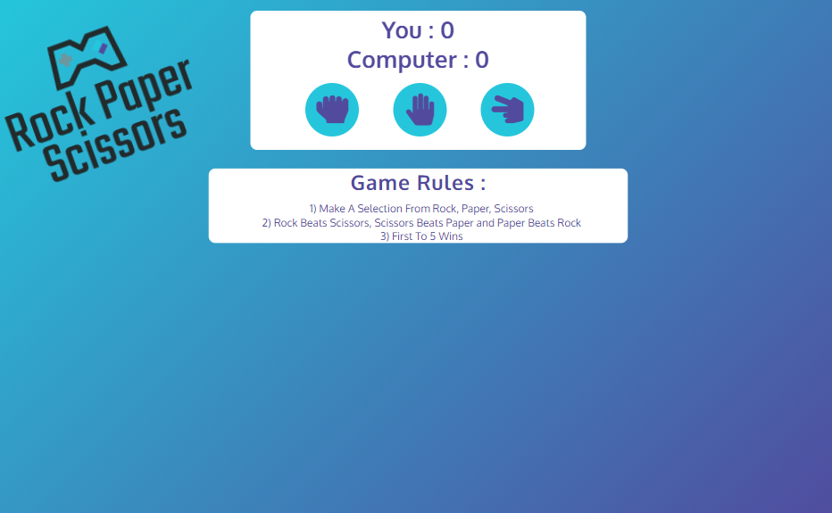

# Rock Paper Scissors Game (by Luke Hickson)

Rock Paper Scissors , Traditionally a Hand Game which is played by 2 people. This Game is often used by 2 persons to make a decision when there are confilcating opinions.
Similar to flipping to coin , a decision can easily and quickly be decided. This website was created to allow user to have online access to the Rock Paper Scissors game.
Access to the game You can viewed the [Live Website Here](https://hluke93.github.io/ms2/).

# Rules of the Game

The players count aloud to three, or speak the name of the game (e.g. "Rock! Paper! Scissors!"), either raising one hand in a fist and swinging it down with each syllable or holding it behind their back. They then "throw" by extending it towards their opponent. Variations include a version where players throw immediately on the third count (thus throwing on the count of "Scissors!"), or a version where they shake their hands three times before "throwing".

# Features

## Existing Features

* **Logo**

The Logo is Located in the top left of the page. The Logo states the name of the game "Rock Paper Scissors". 
The 2 main colors used in the logo are #24C6DC, #514A9D. 
This also indicates to the user what the game being played is. 

* **The Main Game Area**

The main game area consists of the User and Computer Score and the 3 game options (Rock, Paper, Scissors).  
The 2 main colors #24C6DC, #514A9D are used in the user and computer score , and buttons.
