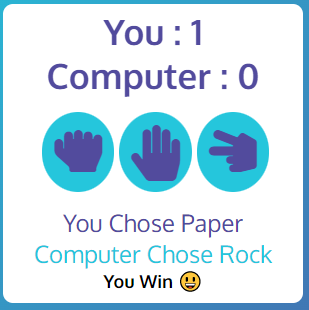
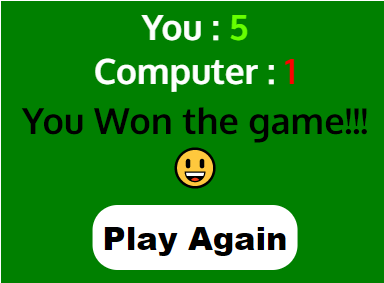
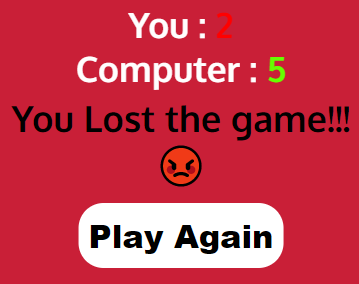

# Rock Paper Scissors Game (by Luke Hickson)

Rock Paper Scissors , Traditionally a Hand Game which is played by 2 people. This Game is often used by 2 persons to make a decision when there are confilcating opinions.
Similar to flipping to coin , a decision can easily and quickly be decided. This website was created to allow user to have online access to the Rock Paper Scissors game.
Access to the game You can viewed the [Live Website Here](https://hluke93.github.io/ms2/).

# Rules of the Game (Historically)

The players count aloud to three, or speak the name of the game (e.g. "Rock! Paper! Scissors!"), either raising one hand in a fist and swinging it down with each syllable or holding it behind their back. They then "throw" by extending it towards their opponent. Variations include a version where players throw immediately on the third count (thus throwing on the count of "Scissors!"), or a version where they shake their hands three times before "throwing".

# Features

## Existing Features

* **Logo**

The Logo is Located in the top left of the page. The Logo states the name of the game "Rock Paper Scissors". 
The 2 main colors used in the logo are #24C6DC, #514A9D. 
This also indicates to the user what the game being played is. 

* **The Main Game Area**

The main game area consists of the User and Computer Score and the 3 game options (Rock, Paper, Scissors).  
The 2 main colors #24C6DC, #514A9D are used in the user and computer score , and buttons.  

* **Game Rules**

The Game Rules are displayed below the main game area. This explains how rock paper scissors is played and the objective which is first to score 5.  

# How the game works and is played

* The user starts be selecting one of the 3 options (Rock, Paper or Scissors).
* Once the user selection is made, the javascript code generates a random  option for the computer choice , compares the user and computer choice , and incremenets the score by 1 , depending on the winner.
* A message appears under the buttons after each score which clearly states the user choice and computer choice , and a result messages  

 

* Once the user or computer reachs a score of 5 , the game is over , a winning or loosing message is displayed onscreen, and there is an option to play again by selecting the play again button  

 

# Testing

* Testing was completed on the following browsers. 
Google Chrome  
Microsfot Eddge  
Firefox  
Safari

* Testing on all 4 browsers yielded the same results. The same expected functionality

* Responsivness was testing by using Dev Tools , Testing on a mobile device and using media queries in CSS.

* Lighthouse in Dev Tools was run on this webpage to check accessibility and performace.  

## Validator Testing

* HTML

No Errors found when passing HTML through the Official W3C Validator  

* CSS

No Errors found when passing CSS through the Official Jigsay Validator  

* JavaScript

https://beautifytools.com/javascript-validator.php was used to validate JavaScript Code. This is not an offical validator but it is a great tool.

## Solved Bugs / Unfixed Bugs

During Testing , I could not solve an issue regarding incrementing the user/computer score. 

After Hours of Research i discovered that i was not using the ''parseInt'' function which converts a string into a number.

There are no reamining unfixed bugs

# Credits

## Technologies Used

* [HTML5](https://en.wikipedia.org/wiki/HTML5) was used for the HTML site markup
* [CSS3](https://en.wikipedia.org/wiki/CSS#CSS_3) was used to style the HTML content
* [Am I Responsive](http://ami.responsivedesign.is/) was used to test the responsiveness of the site
* [Font Awesome](https://fontawesome.com/) was used for the site icons / social icons
* [Google Fonts](https://fonts.google.com/) provided the fonts used on the site
* [Google Chrome Developer tools](https://developer.chrome.com/docs/devtools/) was used to test site responsiveness and to test code
* [Github](https://github.com/HLuke93) was used as the repository hosting service
* [Gitpod](https://www.gitpod.io/) was used as the Code Editor for the site
* [Animate](https://animate.style/) was used for the animation
* [W3C Markup](https://validator.w3.org/) and [Jigsaw validation](https://jigsaw.w3.org/) were used to validate the HTML and CSS used
* [Online Javascript Validator](https://beautifytools.com/javascript-validator.php) was used for Javascript validation.

* **Content** 

The Code used in this website was written by the developer.
The Code institute , Youtube and W3 Schools were used a guides.

* **Media**

The Animation for the Navbar and Social links was take from [Animate](https://animate.style/)
 
The Main Logo was created using [Logo Design](https://www.freelogodesign.org/)

