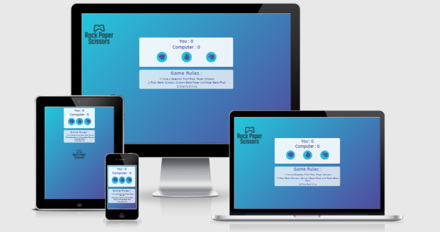
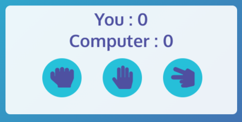
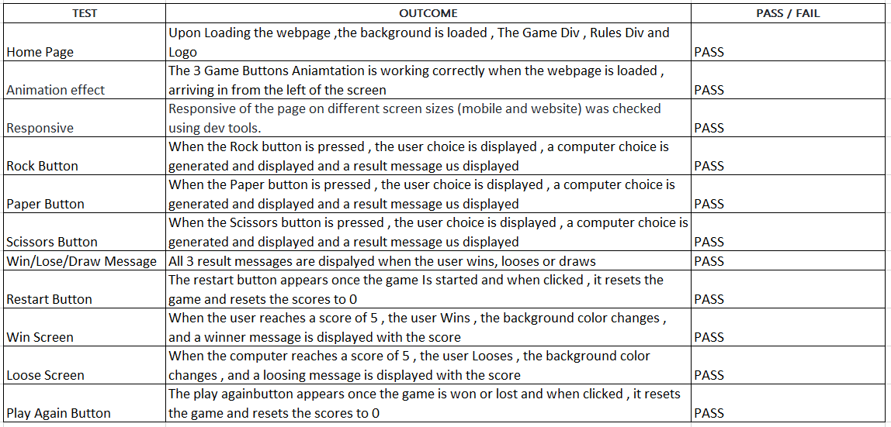

# Rock Paper Scissors Game (by Luke Hickson)

Rock Paper Scissors , Traditionally a Hand Game which is played by 2 people. This Game is often used by 2 persons to make a decision when there are conflicting opinions.
Similar to flipping to coin , a decision can easily and quickly be decided. This website was created to allow user to have online access to the Rock Paper Scissors game.
Access to the game can viewed here.  [Live Website Here](https://hluke93.github.io/ms2/).




## Table of Contents

1. [Rules of the Game ](#Rules)
2. [User Goals](#User-goals)
3. [User Expectations](#User-expectations)
4. [Features](#features)
   1. [Existing Features](#Existing-Features)
   2. [Future Features](#Future-Features)
5. [How the game is Played](#How-the-game-is-Played)
6. [Testing](#Testing)
   1. [Manual Testing](#Manual-Testing) 
   2. [Validator Testing](#Validator-Testing) 
   3. [Solved Bugs](#Solved-Bugs)
7. [Deployment](#Deployment)
8. [Credits](#Credits)
    1. [Technologies Used](#Technologies-Used) 
    2. [Content](#Content) 
    3. [Media](#Media)

<br>

# Rules of the Game (Historically)
<br>

[Go to the top](#Table-of-Contents)

<br>

The players count aloud to three, or speak the name of the game (e.g. "Rock! Paper! Scissors!"), either raising one hand in a fist and swinging it down with each syllable or holding it behind their back.<br> They then "throw" by extending it towards their opponent.<br> Variations include a version where players throw immediately on the third count (thus throwing on the count of "Scissors!"), or a version where they shake their hands three times before "throwing".
<br>

# User Goals

<br>

[Go to the top](#Table-of-Contents)


<br>
The main goal/purpose of this web app/game is to develop a game that allows a user to initiate a game of rock paper scissors against a computer.<br> The computer choice is random there for allowing the user to use this site as a decision making tool when there is a conflicting opinion between parties and the parties choose to use this game to make the end decision. 

<br>

# User Expectations

<br>

[Go to the top](#Table-of-Contents)


<br>


The Game is designed considering the expectation of users to be simple and easy to use and nagivate.
<br>
* The user interface is easy to navigate. Upon opening the page , there are clear instruction on how to play the game.
* The Game generates a random computer choice each time the user selects a button.
* The Game has a scoreboard which is clearly visible and easy to follow.
* The Game can be won or lost.
* The game can be restarted during playing or after the game is over.
* Responsive design for all screen/device sizes like mobile, tablet and desktop.

<br>


# Features

<br>

[Go to the top](#Table-of-Contents)


<br>

## Existing Features
<br>

* **Colour Scheme**
<br>
The Background colour used is linear-gradient(135deg, #24C6DC  , #514A9D ). <br>

The Font colours used are also #24C6DC  , #514A9D  , White and Black are also used. <br>

A  (Green) colour is applied to the background when the user wins. <br>

A  (Red) colour is applied to the background when the computer wins.

<br>

* **Logo**
<br>
The Logo is Located in the top left of the page. The Logo states the name of the game "Rock Paper Scissors".<br>

The 2 main colours used in the logo are #24C6DC, #514A9D.<br>

This also indicates to the user what the game being played is.<br>


<br>

* **The Main Game Area**
<br>
The main game area consists of the User and Computer Score and the 3 game options (Rock, Paper, Scissors). <br>

The 2 main colours #24C6DC, #514A9D are used in the user and computer score , and buttons. <br>


<br>

* **Game Rules**
<br>
The Game Rules are displayed below the main game area. This explains how rock paper scissors is played and the objective which is first to score 5. <br>


<br>

* **Restart Button**
<br>
<br>

During Playing, the user can restart the game by selecting the restart button.<br>


<br>

## Future Features

<br>
In the future, I would like to add more detailed graphics to the game. <br>
I would also like add the Lizard and Spock options to the game.<br>
Finally, i would like to add a feedback form at the end of the game which would rate the users experience and allow a field for user comments.
<br>

# How the game is Played
<br>

[Go to the top](#Table-of-Contents)


<br>

The user starts be selecting one of the 3 options (Rock, Paper or Scissors).<br>
Once the user selection is made, the JavaScript code generates a random  option for the computer choice , compares the user and computer choice , and increments the score by 1 , depending on the winner.<br>
A message appears under the buttons after each score which clearly states the user choice and computer choice , and a result messages <br>

   

* Once the user or computer reaches a score of 5 , the game is over , a winning or loosing message is displayed onscreen, and there is an option to play again by selecting the play again button <br>

 

# Testing

<br>

[Go to the top](#Table-of-Contents)


<br>

## Manual Testing

<br>

* Testing was completed on the following browsers.<br>
Google Chrome <br>
Microsoft Edge <br>
Firefox <br>
Safari
<br>
I have also tested my site on multiple devices such as include:
<br>
Galaxy S5 (360 x 640)<br>
iPad (768 x 1024)<br>
iPhone 12<br>
iPad Pro (1024 x 1366)<br>
HP laptop (1980 x1080)<br>
<br>

## Game Testing
<br>


<br>

* Lighthouse in Dev Tools was run on this webpage to check accessibility and performance. <br>


<br>

## Validator Testing
<br>

* HTML

No Errors found when passing HTML through the Official W3C Validator <br>


<br>

* CSS

No Errors found when passing CSS through the Official Jigsaw Validator <br>


<br>

* JavaScript
<br>

https://jshint.com/ was used to validate JavaScript Code. No Errors Found.


<br>
## Solved Bugs
<br>

During Testing , I could not solve an issue regarding incrementing the user/computer score. 

After Hours of Research I discovered that I was not using the ''parseInt'' function which converts a string into a number.

``` parseInt(document.getElementById("computer-score").innerText); ```

<br>

I discovered missing semicolon in several lines of javascript code which was solved after validation with Jshint.

<br>

There are no remaining unfixed bugs
<br>

# Deployment

<br>

[Go to the top](#Table-of-Contents)


<br>

## GitHub Pages
<br>

Deployment of the site to GitHub Pages was done as follows:

1. Login to my GitHub account <br>
2. Open the project repo <br>
3. Select the 'Settings' tab <br>
4. On the left-hand-side menu select the Pages option <br>
5. Select the main branch as the source, then click the Save button <br>
6. A message will confirm that the site has been published at https://YOUR-GITHUB-NAME.github.io/REPO-NAME/ <br>
7. Test that the site has successfully gone live by clicking on the link

<br>

# Credits

<br>

[Go to the top](#Table-of-Contents)


<br>

## Technologies Used
<br>

* [HTML5](https://en.wikipedia.org/wiki/HTML5) was used for the HTML site markup
* [CSS3](https://en.wikipedia.org/wiki/CSS#CSS_3) was used to style the HTML content
* [Am I Responsive](http://ami.responsivedesign.is/) was used to test the responsiveness of the site
* [Font Awesome](https://fontawesome.com/) was used for the site icons / social icons
* [Google Fonts](https://fonts.google.com/) provided the fonts used on the site
* [Google Chrome Developer tools](https://developer.chrome.com/docs/devtools/) was used to test site responsiveness and to test code
* [Github](https://github.com/HLuke93) was used as the repository hosting service
* [Gitpod](https://www.gitpod.io/) was used as the Code Editor for the site
* [Animate](https://animate.style/) was used for the animation
* [W3C Markup](https://validator.w3.org/) and [Jigsaw validation](https://jigsaw.w3.org/) were used to validate the HTML and CSS used
* [Online JavaScript Validator](https://jshint.com/) was used for JavaScript validation.
* [Background Colour Generator](https://cssgradients.ie/) was used for Main Background Colour.
<br>

## Content 
<br>

The Code used in this website was written by the developer.
The Code institute , YouTube and W3 Schools were used a guides.

<br>

## Media

<br>

The Animation for the Navbar and Social links was take from [Animate](https://animate.style/)
<br>
The Main Logo was created using [Logo Design](https://www.freelogodesign.org/)


